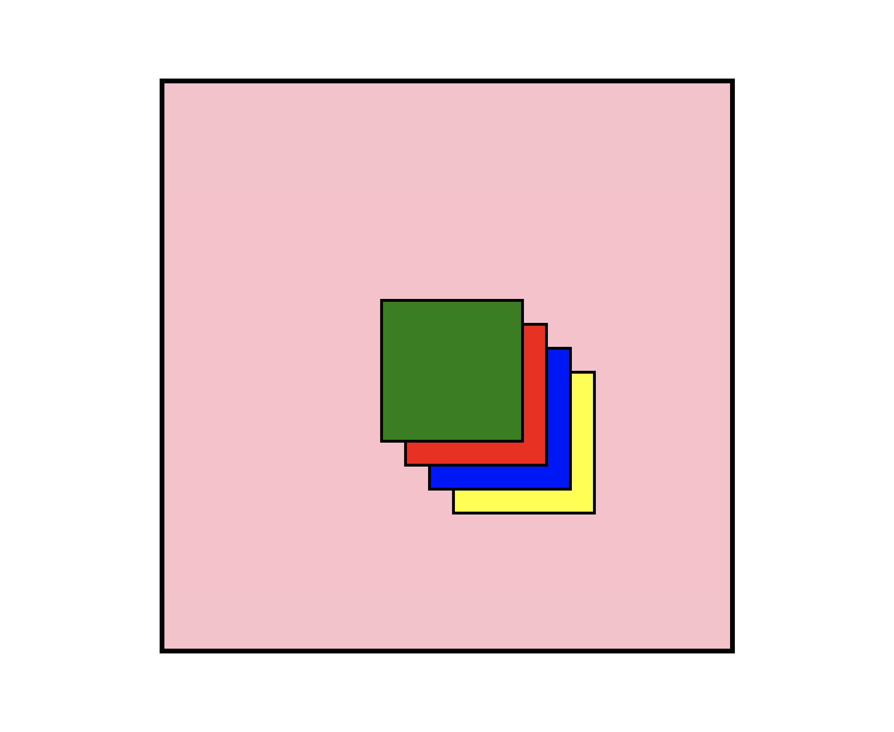

# Coding Bootcamp Daily Notes

## Table of Contents

- [Day 01](#day-01)
  - [Computational Thinking](#computational-thinking)
  - [Git & Command Line](#git-command-line)
  - [User Story & Acceptance Criteria](#user-story-acceptance-criteria)
- [Day 02](#day-02)
  - [Local Repository](#local-repository)
  - [HTML Attributes](#html-attributes)
- [Day 03](#day-03)
  - [CSS Visibility vs Display Property](#css-properties)
- [Day 04](#day-04)
  -[Media Queries](#media-queries)
  -[Flexbox](#flexbox)
- [Day 05](#day-05)
  -[CSS Reset](#css-resets)
- [Day 06](#day-06)

## Day 01

### Computational Thinking

- Is a way of logically breakdown a problem so that we can develop a step by step solution.

- Break a complex problem into smaller parts, and then developing possible solutions that can be clearly presented in a way that computers and/or humans can understand.

The **Four Cornerstones** of computational thinking are:

- **Decomposition**
      : means breaking down a problem into smaller tasks. Breaking a complex problem into smaller problems or subtasks makes solving the larger problem         more manageable.

- **Pattern Recognition**
      : Thinking about how we've solved these subtasks previously and finding any patterns that might help us to solve this particular problem.

- **Abstraction**
      : Is only focusing on relevant information and that we are disregarding details that won't help us solve this problem.

- **Testing & Debugging Algorithms**
      : An algorithm is essentially a sequence of steps or rules that we can use to solve our problem. Think of it as a set of instructions and a recipe.

### Git Command Line

- `pwd`
  : Print working directory

- `Tab key`
  : Auto complete (case sensitive)

- `mkdir <name of directory>`
  : make new directory

- `rmdir <name of directory>`
  : remove directory

- `rm <file name>`
  : remove file

- `ls`
  : lists all files and directories within the current directory

- `ls -1`
  : same as above, however, lists on individual lines

- `ls -1a`
  : same as above, however, includes any hidden files

- `touch <file name>`
  : add file ls

- `open <file name>`
  : opens file

- `code .`
  : will open directory in Visual Studio Code

- `cd <name of directory>`
  : move into the directory

- `cd` 
  : takes you back to the root directory of the current drive

- `cd ..`
  : takes you back one directory

- `rm -rf .git`
  : removes repository from the directory

- `git init`
  : creates a new repository in the current directory

- `git clone <url>`
  : clones the repository from the remote repository 

- `git branch`
  : let's you know what branch you are working on

- `git add .`
 : will push the current modified or untracked files to the staging area

- `git add -A`
  : will push **all** modified or untracked files to the staging area

- `git remote`
  : tells you if the repository is linked to a remote repository and its name

- `git remote -v`
  : -v stands for verbose. This command will give you the url of the remote repository

- `git remote remove origin`
  : This will remove the link to the remote repository from the local repository

- `git remote add origin <url of remote repository>`
  : This will link the local repository to the remote repository

- `git push -u origin main`
  : This will push the current version of the local repository upstream to the remote repository onto the main branch

- `git checkout <branch name>`
  : to switch to another branch

- `git checkout -b "new branch name"`
  : to switch to a brand new branch

- `git commit -m "commit message"`
  : makes a commit of any files that are in the staging area and adds a commit message

- `git commit` 
  : same as above, except you will be given the option to be able to add a commit message and a description of the commit

- `git cp`
  : copy file(s) and/or directories

- `git pull`
  : downloads latest changes into the local repository, and it also automatically merges change in your working directory. It doesn't give you a chance to review the changes before merging, and as a consequence, 'merge conficts' can and do occur. One **important** thing to keep in mind is that it will merge only into the current working branch. *Other branches will stay unaffected.*

- `git fetch`
  : only downloads latest changes into the local repository. It downloads fresh changes that other developers have pushed to the remote repository since the last fetch and allows you to review and merge manually at a later time using git merge.

- `git merge`
  : the concept of git merging is basically to merge multiple sequences of commits, stored in multiple branches into a single branch. 

### User Story Acceptance Criteria

**User Stories**
When you create websites or web applications, you typically do not work on them in isolation for your own enjoyment. It's more likely that you're creating something that will be used by someone else. The first step then is to identify who that user is. If you start building something without a clear idea of the intended user, you might end up with something functional and pretty that doesn't meet the user's needs. And if it doesn't meet your user's needs, it won't be successful.

That's where user stories come in. A user story is simply a short description of the user you're creating an application for. It ensures that you keep your audience in mind when working on the different parts, or features, of your applications.

A user story consists of the following three sections:

- The type of person using your application
- What the user wants from the application
- Why the user wants what they want (i.e., what problem are they trying to solve?)

Format

- As an ... I want ... so that ...

Ex.

- As a shopper visiting an online store, I want to place items in a shopping cart, so that I can purchase them.

**Acceptance Criteria**
These are the requirements that you must meet to satify the scope of work. They are not exhaustive, but they do entail the minimum aspects of a working solution. Consider this a checklist of baseline requirements.

Acceptance criteria can be presented in various ways. In this case, we'll use a criteria format called scenario-oriented criteria which expresses each requirement in a **When / Then**
format.

---

## Day 02

### Local Repository

There are two ways to setup a local git repository

Clone an existing repository from a remote repository

- To clone an existing repository onto your local machine we have to create a new repository on Github, GitLab or Bitbucket first. Give the repository a name and description. Choose to make it *public or private*. Initialize the repository with a *README file*. Add a .gitignore using a *node* template. Choose a *MIT* license.

- Next we have to establish a link from the remote repository to our local directory where we would like the repository to live. Move into the directory on your local computer where you would like to clone the remote repo to and enter the follow:
`git clone <url>`

- This will do two things. It will make a copy of the remote repo to our local machine and it will also establish a link from our remote repo to our local repo.

Create a local repository on our computer

- Locate the directory that we wish to create the new repository in the terminal.
- Enter the git command `git init`. This will initialize the directory into a repository.
- Hop over to Github and create a new repository. *This time, do not  initialize the repository. Skip this step if you are importing an existing repository.*

- If you would like to create a README.md file in your local repo, use the command line command `touch README.md`.

- If we have any existing files in our local repo, we must stage and then commit these files. To stage the files `git add .` or `git add -A`, this will push all untracked files to the staging area. Next, we have to commit these files `git commit -m "Intial commit"`.

- Next, we have to establish a link from our local repo to our remote repo. In the terminal, type `git remote add origin <url>`. This will create the link to the remote repo that we created earlier.

- Lastly, we need to import our local repo into our remote. Type `git push -u origin main`. This will push the local repo upstream into our remote main branch.

---

### HTML Attributes

>An attribute extends an HTML element, changing its behavior or providing metadata.
>An attribute always has the form `name="value"` (the attribute's identifier followed by its associated value).
>You may see attributes without the equals sign or a value. That is a shorthand for providing the empty string in HTML, or the attributes's name in XML.

ex.

```HTML
<input required />
<!-- is the same as… -->
<input required="" />
<!-- or -->
<input required="required" />
```

---

### CSS Selectors

[Mozilla Attribute Selectors](https://developer.mozilla.org/en-US/docs/Web/CSS/Attribute_selectors)
[Mozilla CSS Selectors](https://developer.mozilla.org/en-US/docs/Web/CSS/CSS_Selectors)

Basic Selectors

- Universal Selector: `*` will match all the elements of the document.

- Type Selector: selects all elements that have the given node name. `body` `header` `main` `section` `footer` 

- Class Selector: selects all elements that have the given class attribute. `.container` `.card` `.card__content` `card__title` 
The syntax for the class attribute: `class="given-class-name"`

- ID Selector: selects an element based on the value of its `id` attribute. *There should be only one element with a given ID in a document. `#card-1` `#fb-icon` `#linkedin-icon` 
The syntax for the id attribute: `id="given-id-name"`

- Attribute Selectors: select all elements that have the given attribute. `[attr]` `[attr=value]` `[attr~=value]` `[attr|=value]` `[attr^=value]` `[attr$=value]` `[attr*=value]` 

```CSS
/* <a> elements with a title attribute */
a[title] {
  color: purple;
}

/* <a> elements with an href matching "https://example.org" */
a[href="https://example.org"]
{
  color: green;
}

/* <a> elements with an href containing "example" */
a[href*="example"] {
  font-size: 2em;
}

/* <a> elements with an href ending ".org" */
a[href$=".org"] {
  font-style: italic;
}

/* <a> elements whose class attribute contains the word "logo" */
a[class~="logo"] {
  padding: 2px;
}
```

Combinators

- Selector List: a comman-seperated list of selectors. *Both span and div elements will be styled with the border value.*

```CSS
span,
div {
  border: red 2px solid;
}
```

- Single line grouping

``` CSS
h1,
h2,
h3,
h4,
h5,
h6 {
  font-family: helvetica;
}
```

- Multi line grouping

``` CSS
#main,
.content,
article,
h1 + p {
  font-size: 1.1em;
}
```

---

## Day 03

### CSS Properties

- The `visibility: hidden;` property is used to specify whether an element is visible or not in a web document, however, it is important to note that the hidden elements take up space in the web document. *The visibility is a property in CSS that specifies the visibility behaviour of an element.*

- The `display: none;`property is used to specify whether an element exists or not on the website. It defines how the components (such as div, hyperlinks, headings, etc) are going to be placed on the web page.

visibility syntax:

```CSS
visibility: visible | hidden | collapse | initial | inherit;
```

Property Values:

- visible: is the default value.
- hidden: the element is not visible, but the layout is still affected. The element may not be seen, but it still keeps the space.
- collapse: hides the element when it is used on a table row or a cell.
- initail: will set the visibility to its default value.
- inherit: it will inherit the property value from its parent element.

display syntax:

```CSS
display: none | inline | block | inline-block;
```

Property Values:

- none: it will not display the element and remove any space it held in the layout.
- inline: is the default value.
- block: it sets the element to block-level.
- inline-block: it sets the element to a block box inside an inline box. This is required often to change an inline element into a inline-block so you can apply top and bottom margins.

Simply put, `display: none;` completely gets rid of the tag, as it had never existed in the HTML page whereas `visibility: hidden;` just makes the tag invisible, it will still sit on the HTML page occupying space, it's just invisible.

---

### Position in CSS

There are 7 values to the **Position** property:

- Static
- Initial
- Inherit
- Relative
- Sticky
- Absolute
- Fixed

---

Static:
Is the default value. The a position property and value is only applied when we want the element to not behave static.
Static basically loads the elements in a top down approach. The elements will be loaded in the sequence they were written.

Relative:
The relative position supports offset properties like (left, right, top, bottom).
So defining the position as relative, then you can offset properties like left, right, top and bottom to move the position of the element which will be relative to its normal position (in the HTML flow) based on those properties.

Absolute:
Absolute positioning allows us to move the element(s) relative to only its parent (non-static position element).
*Note: the parent element does not have to be its direct parent element, it can any ancestor element.*

Lets say we have an image inside a div container. We can move the position of the image using the absolute property with the offset properties relative to the div. Remember the div must not be static position. So we can apply a `position: relative` rule to the div container.

```HTML
<div class="container">
  
</div>
```

```CSS
.container {
  width: 90%;
  max-width: 400px;
  position: relative;
}

#image-1 {
  width: 200px;
  height: 200px;
  position: absolute;
  top: 50%;
  left: 50%;
  transform: translate(-50%, -50%)
}
```

*The above example would center the image relative to the div container.*

It is important to note that you must be careful while using absolute value, as its hard to maintain an can cause problems with the site's responsiveness.

Fixed:
Fixed behaves similar to absolute but with one clear difference. The position of the element is not relative to the parent element but rather it is relative to the **viewport** (document screen).

- Fixed position is generally used for creating modal popups, sticky navigation bars and footers.

*Note: be careful while using fixed positon as you will be positioning elements directly on the viewport.*

Sticky:
The sticky position is a special position value, as it behaves bot like a *relative* positioned element as well as a *fixed* positioned element.

The element is position relative to the HTML document, but this position changes to fixed, when the element passes a certain scroll point. So the element will stay fixed relative to the viewport. The element will change back to relative, once the element has rollback into the threshold value.
*Note: for fixed to work, an offset value has to be provided like top, bottom, left or right.

Intial:
Is actually a value that overwrites the position value and sets it to the default value static.

Inherit:
The element **inherits** the parent's position value and sets it as its own.

---

Float

- The `float` property specifies whether an element should float to the left, right, or not at all. The default value is none.

*Note: Absolutely positioned elements ignore the `float` property!*
*Note: Elements next to a floating elemetn will flow around it. To avoid this, use the `clear` property of the clearfix hack.*

Syntax:
`float: none | left | right | initial | inherit;`

Clear

- The clear property specifies what should happen with the element that is next to a floating element.

- When we use the float property, and we want the next element below (not on right or left), we will have to use the `clear` property.

The `clear` property can have one of the following values:

- none: This is the default. The element is not pushed below left or right of floated elements.

- left: the element is pushed below left floated element.

- right: The element is pushed below right floated element.

- both: The element is pushed below both left and right floated elements.

- inherit: The element inherits the clear value from its parent.

---

Z Index
`z-index` is a css property that defines the order of overlapping HTML elements. Elements with a higher index will be placed on top of elements with a lower index.

*Note: `z-index` only works on positioned elements (`position: absolute`, `position: relative`, or `position: fixed`).

The default value is auto.
Syntax:
`z-index: 1 | 0 | -5 | 100 | inherit | initial | unset;`

Example:

```HTML
<div class="container">
  <div class="box box--one"></div>
  <div class="box box--two"></div>
  <div class="box box--three"></div>
  <div class="box box--four"></div>
</div>
```

```CSS
.container {
  position: relative;
  width: 600px;
  height: 600px;
  border: 5px solid black;
  background-color: pink;
}

.box {
  position: absolute;
  width: 150px;
  height: 150px;
  border: 3px solid black;
  
}

.box--one {
  background-color: green;
  z-index: 4;
  top: 225px;
  left: 225px;
}

.box--two {
  background-color: red;
  z-index: 3;
  top: 250px;
  left: 250px;
}

.box--three {
  background-color: blue;
  z-index: 2;
  top: 275px;
  left: 275px;
}

.box--four {
  background-color: yellow;
  z-index: 1;
  top: 300px;
  left: 300px;
}
```



---

Margin Collapsing

## Day 04

### Media Queries

Media queries ca be used to check many things, such as:

- width and height of the viewport

- width and height of the device

- orientation (landscape or portrait mode)

- resolution

Syntax:
`@media not|only *media type* and (expression) {
  *CSS code*
}`

Example:
```CSS
@media screen and (max-width: 700px) {
  .header {
    flex-direction: column;
  }
}
```

<!-- If the device screen and viewport is 700px or less in width (true) then apply the following css rules within the  -->

Media Types

- all: used for all media type devices

- print: used for printers

- screen: used for all devices with screens

- speech: used for screen-readers


Mobile First Design

Mobile first means designing for mobile before designing for desktop or any other device. 
*Note: This wil make the page display faster on smaller devices.*

Instead of changing styles when the width gets smaller, we should change the design when the width gets larger. This is mobile first design.

The value of the condition at which the media query changes from false to true is known as a breakpoint.

Example:

```CSS
@media screen and (min-width: 400px) and (max-width: 1440px) {
  .main {
    flex-direction: column;
  }
}
```

<!-- The above example has two break points. One at 400px and the other at 1440px. -->

Typical Device Breakpoints
There are tons of screens and devices with different heights and widths, so it is hard to create an exact breakpoint for each device. To keep things simple you could target five groups:

```CSS
/* Extra small devices (phones, 600px and down) */
@media only screen and (max-width: 600px)v {...}

/* Small devices (portrait tablets and large phones, 600px and up) */
@meda only screen and (min-width: 600px) {...}

/* Medium devices (landscape tablets, 768px and up) */
@media only screen and (min-width: 768px) {...}

/* Large devices (laptops/desktops, 992px and up) */
@media only screen and (min-width: 992px) {...}

/* Extra large devices (large laptops and desktops, 1200px and up) */
@media only screen and (min-width: 1200px) {...}
```

### Flexbox

When we apply the CSS property `display: flex;`, there is a whole lot of other properties that will be applied to the child elements. It is as if we wrote these default stylings ourselves:

```CSS
.child {
  flex: 0 1 auto; /* Default flex value */
}
```

The flex property above is a shorthand property. It is the same as:

```CSS
.child {
  flex-grow: 0;
  flex-shrink: 1;
  flex-basis: auto;
}
```

The flex property tells the child elements how to stretch and expand.

Like about it like this:

```CSS
.child {
  flex: [flex-grow] [flex-shrink] [flex-basis];
}

/* or */

.child {
  flex: [max] [min] [ideal size];
}


- `flex-grow: 0;` is the default value. This makes sense as we don't want our elements to expand at all (most of the time).
We normally want the element to grow naturally depending on the content inside it.

If we change the `flex-grow: 1` to all the .child elements, then they will take an equal portion of the .parent element.
*Note: only if the lengths of their contents are the same.*


If you just declare the flex-grow property and not the flex-shrink or flex-basis, not to worry, they will just use their default 
values.

Say we wanted to make one of the .child elements grow more than the others?

```CSS
.child {
  /* flex: 0 1 auto; */
}

.child-1 {
  flex-grow: 3;
}
```

Look at it like this:
`flex: [max] [min] [ideal size];`

Try remember this:

- Use the flex shorthand

- Remember max, min and ideal size when doing so

- Remember that the content of an element can impact how these values work together, too.

## Day 05

### CSS Resets

A CSS reset style sheet is a list of rules that 'reset' all of the default browser styles.

We reset the browser styles for two primary reasons:

- **Not all browsers apply the same default rules.** They may be similar, but not exact.

- Once you start designing and coding all of the fine details of your site, you may discover that a lot of what you are doing is simply **overriding** default browser styles.** The reset does this quickly so that you don't have to.

#### Including the Reset Style sheet using severall different methods.

We can use the reset style sheet as an external style sheet just like we do with our normal styles. 
**Note: It is important that we add it first**, since order matters.

```HTML
<!DOCTYPE html>
<html lang="en">
<head>
    <meta charset="UTF-8">
    <meta http-equiv="X-UA-Compatible" content="IE=edge">
    <meta name="viewport" content="width=device-width, initial-scale=1.0">
    <link rel="stylesheet" href="reset.css">
    <link rel="stylesheet" href="style.css">
    <title>Example</title>
</head>
<body>
    
</body>
</html>
```

#### Copy and Paste Into Own Style Sheet

You can also simply copy all of the rules from the reset style sheet and paste them into your own.
**Note: Make sure that you put them at the top so that they don't override any of your rules.**

If you use this method, be sure to clearly mark the reset section of the style sheet and give credit to the author using CSS comments.

#### Normalize Style Sheet

There is a new technique that takes a slightly different approach: normalize.css. Instead of trying to eliminte the default browser styles, the normalize.css instead tries to normalize them to standard values across browsers. This removes some of the downsides of certain copy paste resets such as the **Meyer Reset**. It is also a newer and actively developed stylesheet, so it includes more modern HTML elements.

### Typography

#### Web Fonts

Most people don't ever intentionally install typefaces on their computers. Instead, they simply rely on the typefaces that get installed with the operating system and other software.

Web Safe Fonts

If we ask for a font that the user doesn't have the font will:

- not display.

- A different font is used instead (usually chosen by the browser)

As designers, we **always** want to have control of the font veing rendered.

### Font Stacks

When specifying fonts for web pages, we use a system of 'fallbacks', called a **font stack**

The font stack allows us to:

1. choose the font we want most

2. choose the font we want if the first one isn't available

3. choose any number of other fonts that we might want to fallback on

4. choose a last resort font

This allows us to be sure that we have some control over what font is displayed in our website. Even if the user doesn't have our first choice font, they have some font that **we chose**. 

When selecting your font stacks, you should choose several fonts that are the same type of font (serif, sans serif, slab serif, script, etc.).

You should also consider the spacing and x-height of a typeface. They can look drastically different if not chosen carefully. Additionally, some typefaces will take up much more space than others, causing your layout to differ significantly depending on the typeface rendered.

- Sample comparison of two serif typefaces

- Sample comparison of two sans-serif typefaces

- Real life example with News Gothic

- They should be listed in order of your preference and also by prevalence.

Your second-to-last font choice should be installed on most systems.

The last choice is mostly just there to make sure the right classification of font shows up if all else fails. We hope to never get to this point, but just in case.

### Why should we care about web safe fonts

- Bulletproof fallbacks - we need to specify reasonable alternatives to our custom fonts

- Performance - fonts that are not on a user's computer need to be downloaded and will take longer to load and consume more bandwidth

- Accessibility - web safe fonts have generally been designed for the screen with readability in mind. Other fonts, not necessarily.


## Day 06

### Pseudo Elements

What are pseudo-elements?
A css pseudo element is used to style specified parts of an element.

Common examples:

- Style the first letter, or line, of an element

- Insert content before, or after, the content of an element

Syntax:

```CSS
selector::pseudo-element {
  property: value;
}
```

Ex.

```CSS
h1::first-line {
  font-size: 2em;
  font-family: serif;
}

h2::first-letter { 
  font-size: 2em;
  font-family: serif;
}

.submit-btn::before {
  content: "enter content here";
}

.submit-btn::after {
  content: url(smiley.gif);
}
```

#### Other Pseudo-elements

::marker
The ::marker pseudo-element selects the markers of list items.
So you can style how the list markers look essentially. 

```CSS
::marker {
  color: green;
}
```

::selection
The ::selection pseudo-elemeent allows you to style the look of the selected element, (like if you are to highlight some text
with the cursor) and apply a style to that highlight.

---

### CSS Pseudo Classes

### All CSS Pseudo Classes

- `:active`
  `a:active`
    Selects the active link

- `:checked`
  `input:checked`
    Selects every checked `<input>` element

- `:disabled`
  `input:disabled`
    Selects every disabled `<input>` element

- `:empty`
  `p:empty`
    Selects every `<p>` element that has no children

- `:enabled`
  `input:enabled`
    Selects every enabled `<input>` element

- `:first-child`
  `p:first-child`
    Selects every `<p>` elements that is the first child of its parent

- `:first-of-type`
  `p:first-of-type`
    Selects every `<p>` element that is the first `<p>` element of its parent

- `:focus`
  `input:focus`
    Selects the `<input>` element that has focus

- `:hover`
  `a:hover`
    Selects links on mouse over

- `:in-range` `input:in-range`
    Selects `<input>` elements with a value within a specified range

- `:invalid`
  `input:invalid`
    Selects all `<input>` elements with an invalid value

- `:lang`(language)
  `p:lang(it)`
    Selects every `<p>` element with a lang attribute value starting with "it"

- `:last-child`
  `p:last-child`
    Selects every `<p>` elements that is the last child of its parent

- `:last-of-type`
  `p:last-of-type`
    Selects every `<p>` element that is the last `<p>` element of its parent

- `:link`
  `a:link`
    Selects all unvisited links

- `:not(selector)`
  `:not(p)`
    Selects every element that is not a `<p>` element

- `:nth-child(n)`
  `p:nth-child(2)`
    Selects every `<p>`element that is the second child of its parent

- `:nth-last-child(n)`
  `p:nth-last-child(2)`
    Selects every `<p>` element that is the second child of its parent, counting from the last child

- `:nth-last-of-type(n)`
  `p:nth-last-of-type(2)`
    Selects every `<p>` element that is the second `<p>` element of its parent, counting from the last child

- `:nth-of-type(n)`
  `p:nth-of-type(2)`
    Selects every `<p>` element that is the second `<p>`element of its parent

- `:only-of-type`
  `p:only-of-type`
    Selects every `<p>` element that is the only `<p>` element of its parent

- `:only-child`
  `p:only-child`
    Selects every `<p>` element that is the only child of its parent

- `:optional`
  `input:optional`
    Selects `<input>` elements with no "required" attribute

- `:out-of-range`
  `input:out-of-range`
    Selects `<input>` elements with a value outside a specified range

- `:read-only`
  `input:read-only`
    Selects `<input>` elements with a "readonly" attribute specified

- `:read-write`
    `input:read-write`
    Selects `<input>` elements with no "readonly" attribute

- `:required`
  `input:required`
    Selects `<input>` elements with a "required" attribute specified

- `:root`
    Selects the document's root element

- `:target`
    `#news:target`
    Selects the current active #news element (clicked on a URL containing that anchor name)

- `:valid`
  `input:valid`
    Selects all `<input>` elements with a valid value

- `:visited`
    `a:visited`
    Selects all visited links

---

### CSS Combinators

A combinator is something that explains the relationship between the selectors.

A CSS selector can contain more than one simple selector. Between the simple selectors, we can include a combinator.

There are four different combinators in CSS:

- descendant selector (space)

- child selector (>)

- adjacent sibling selector (+)

- general sibling selector (~)

#### Descendent Selector

The descendant selector matches all elements that are descendants of a specified element.

*Note: VS Code has a awesome tooltip when you hover over the selector in the editor. It will inform you the parent element and then which child(s) are getting selected.*

```CSS
div p {
  color: red;
}
```

#### Child Selector

The child selector selects all elements that are the children of a specified element.

This is best shown with an example:

```CSS
div > img {
  width: 50%;
}
```

The above example will apply a width of 50% to all images that are child element of a div element.

#### Adjacent Sibling Selector (+)

The adjacent sibling selector is used to select an element that is directly after another specific element.
Sibling elements must have the same parent element, and "adjacent" means "immediately following".

The following example selects the first `<p>` element that are placed immediately after `<div>` elements:

```CSS
div + p {
  background: green;
}
```

The above code would select the very next `<p>` element that is a sibling of a `<div>`.
*Note: Important, it will select the **SIBLING** element, not a **CHILD**.*

#### Genral Sibling Selector (~)

The general sibling selector selects all elements that are next siblings of a specified element.

The following example selects all `<p>` elements that are next siblings of `<div>` elements:

```CSS
div ~ p {
  color: red;
}
```

